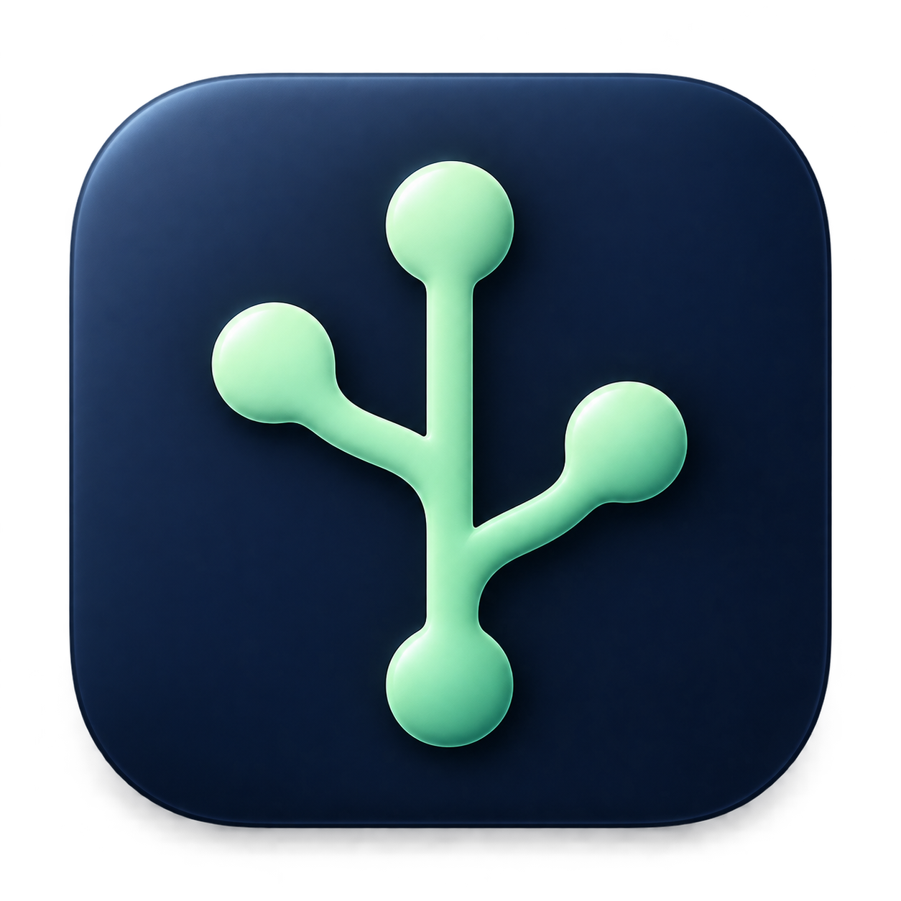

<p align="center"></p>
<h1 align="center">Sprig</h1>
<p align="center">A lightweight, native Git workspace for macOS.</p>
<p align="center"><a href="https://github.com/zhiyu547/sprig/releases/latest">Download</a> · <a href="README.md">简体中文</a></p>

Review changes, stage files, write focused commits, and synchronize before pushing in a SwiftUI + AppKit desktop app. Sprig uses the system Git installation.

## Install

Download the DMG or ZIP from [Releases](https://github.com/zhiyu547/sprig/releases/latest) and move Sprig.app into Applications. Requires macOS 13+ and a working system Git (`git --version`). The universal app includes Apple Silicon and Intel slices. Intel and older macOS releases still need more real-device testing; current validation is on Apple Silicon / macOS 27.

Release builds are currently **ad-hoc signed, without Apple Developer ID signing or notarization**. macOS may require explicit approval on first launch. Follow [Apple's guidance](https://support.apple.com/102445) after verifying the download source.

Version 0.4.0 introduces Sparkle updates. Users of 0.3.x need one manual upgrade. Use the application menu to check for updates; automatic daily checks can be disabled in About Sprig. Update metadata and archives are cryptographically signed. Installation requires user confirmation and waits for active operations or application dialogs to finish.

## Features

- Tracked and untracked changes, file staging, split and unified diffs.
- Resizable file list, code pane, and commit composer with persistent sizes.
- Commit, amend, push, branches, tags, history, stash, cherry-pick, and revert.
- Fetch and merge/rebase before pushing; pause, resume, or abort on conflicts.
- AI commit messages and review using a user-configured Chat Completions endpoint.
- Reviewed send scope, exclusion rules, editable output, and API keys in Keychain.

Line-level staging, a three-way conflict editor, interactive rebase, a full graph, and clone/remote configuration UI are not yet implemented. Git authentication uses your existing system Git/SSH configuration. The application UI is primarily Chinese; AI output can use Chinese or English.

## Build

Requires macOS, Xcode / Command Line Tools, and Swift 5.9+:

```sh
swift test --package-path native
python3 -m unittest discover -s native/scripts/tests -v
swift build --package-path native -c release --product GitTool --arch arm64 --arch x86_64
python3 native/scripts/package_app.py --arch universal
open native/build/Sprig.app
```

Sparkle is pinned in Swift Package Manager. Forks must configure their own repository, update feed and signing key before distributing builds. See [release maintenance](docs/releasing.md).

## License

**Copyright © 2026 zhiyu.** Sprig uses the custom [Sprig Non-Commercial Share-Alike License 1.0](LICENSE). It is **source-available**, not OSI-approved open source.

Personal non-commercial use and internal business use are permitted, including working on commercial repositories. Commercial redistribution, product integration, external commercial services, and paid Sprig-specific services require separate written permission. External distributions and services must provide complete corresponding source under the same license. Your independently developed repositories do not become covered by this license merely because you use Sprig.

See [third-party notices](THIRD_PARTY_NOTICES.md), [privacy](PRIVACY.md), [contribution rules](CONTRIBUTING.md), and [security reporting](SECURITY.md).
