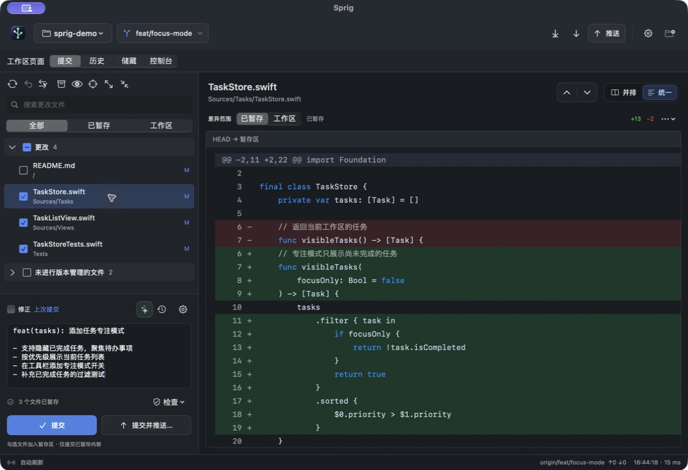
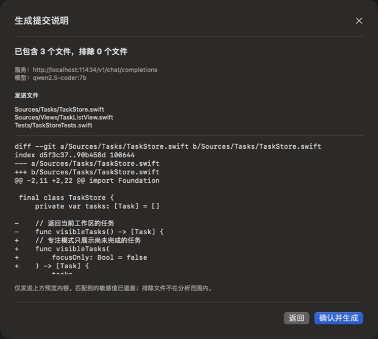
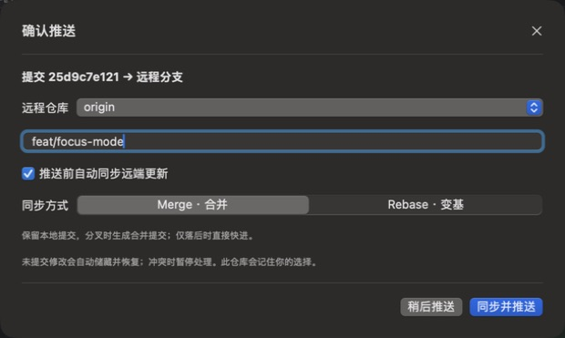
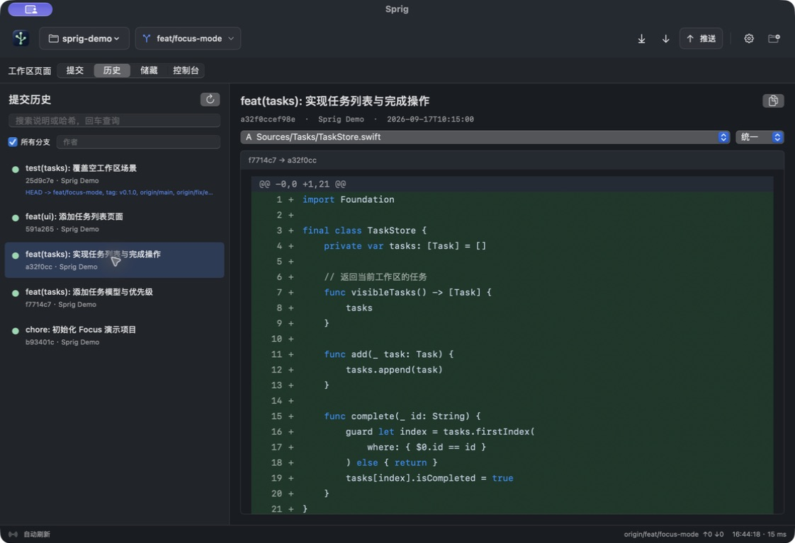

<p align="center"></p>
<h1 align="center">Sprig</h1>
<p align="center"><strong>让每一次提交，都清晰可见。</strong></p>
<p align="center">轻量原生 macOS Git 客户端 · 代码审阅 · AI 提交说明 · 同步推送</p>

<p align="center">
  <a href="https://github.com/zhiyu547/sprig/releases/latest"></a>
  
  
  <a href="LICENSE.zh-CN.md"></a>
</p>

<p align="center"><strong><a href="https://github.com/zhiyu547/sprig/releases/latest">下载 macOS 版</a></strong> · <a href="README.en.md">English</a> · <a href="native/README.md">使用指南</a> · <a href="https://github.com/zhiyu547/sprig/issues">反馈问题</a></p>



<p align="center"><sub>真实应用截图，使用独立演示仓库；代码与提交说明均为示例。<a href="docs/media/README.md">截图说明</a></sub></p>

## 一个窗口，完成一次清晰的提交

Sprig 把**查看改动 → 选择文件 → 编写提交说明 → 同步并推送**连在一起。你可以继续使用熟悉的编辑器，随时打开 Sprig，整理这一次要提交的内容。

| 轻量原生 | AI 辅助，保留你的判断 | 协作推送少一步操作 |
| --- | --- | --- |
| SwiftUI + AppKit，调用系统 Git。v0.4.0 通用 ZIP 约 **4.4 MiB**，DMG 约 **4.8 MiB**。 | 基于暂存差异生成“标题 + 改动列表”。发送前可预览，生成后可编辑。 | 推送前获取远端更新，按选择 Merge / Rebase；遇到冲突暂停，由你处理后继续。 |

### 看清改了什么，也看清将要提交什么

- **文件分组清楚**：更改与未跟踪文件分开显示，勾选文件加入暂存区。
- **差异范围明确**：切换已暂存 / 工作区，支持并排与统一 Diff、基本语法高亮。
- **空间由你调整**：左右分栏、文件列表与提交区域都可拖动，保留布局尺寸。
- **常用操作就在手边**：提交、修正上次提交、提交并推送、提交说明历史。

### AI 帮你整理改动，提交说明保持简洁

点击编辑框上方的 AI 图标，先确认本次发送的文件与差异，再生成提交说明或进行代码审查。可接入兼容 Chat Completions 的服务，也可连接本机 Ollama；API Key 保存在 macOS Keychain。

提交说明格式示例：

```text
feat(tasks): 添加任务专注模式

- 支持隐藏已完成任务，聚焦待办事项
- 按优先级展示当前任务列表
- 在工具栏添加专注模式开关
- 补充已完成任务的过滤测试
```

<p align="center"></p>

**你决定发送什么，也决定最终提交什么。** 支持文件排除规则与敏感值遮盖；请核对预览，自动脱敏不能识别所有秘密。AI 输出不代表已经运行编译或测试。详见 [隐私说明](PRIVACY.md)。

### 推送前，自动同步团队的最新改动

开启“推送前自动同步远端更新”，选择合并或变基。未提交的修改会自动储藏并恢复；遇到冲突时暂停，可以处理后继续，也可以中止同步。推送不会强制覆盖远端历史。

<p align="center"></p>

### 分支、历史与临时修改，都有入口

查看和切换本地 / 远程分支与标签，搜索提交说明、哈希或作者，点选历史记录查看对应文件差异。Git Stash、Cherry-pick 与 Revert 也已提供。



## 开始使用

1. 从 [Releases](https://github.com/zhiyu547/sprig/releases/latest) 下载 **DMG**，将 Sprig 拖入“应用程序”。也可下载 ZIP 解压安装。
2. 打开本地 Git 仓库，查看差异，勾选本次需要提交的文件。
3. 自己填写提交说明，或在设置中连接 AI 服务后点击生成，核对后提交。

**运行要求：** macOS 13+，Apple Silicon 或 Intel，以及可用的系统 Git。先运行 `git --version`；如系统提示，安装 Apple Command Line Tools。AI 服务需自行配置，是否收费由你选择的服务商决定。

> **首次打开：** 当前安装包采用 ad-hoc 签名，尚未 Apple Developer ID 签名／公证。macOS 可能提示无法验证开发者；确认下载来自本仓库后，按系统“隐私与安全性”页面提示处理。参阅 [Apple 官方说明](https://support.apple.com/102445)。

**后续更新：** 在 **Sprig → 检查更新…** 获取新版本。“关于 Sprig”中可管理每日自动检查；更新包与版本清单均有签名校验，安装需确认，并等待当前操作结束。0.3.x 用户需手动安装 0.4.0 一次。

## 功能一览

| 工作环节 | 已支持 |
| --- | --- |
| 审阅修改 | 文件分组、搜索、并排 / 统一 Diff、基本语法高亮 |
| 整理提交 | 文件级暂存 / 取消暂存、部分暂存状态识别、草稿、Amend、Sign-off |
| AI 辅助 | 提交说明、代码审查、发送预览、排除规则、结果编辑 |
| 协作同步 | Fetch、快进 Pull、推送前 Merge / Rebase、冲突暂停 / 继续 / 中止 |
| 仓库浏览 | 分支、标签、提交历史与差异、Stash、Cherry-pick、Revert |
| 桌面体验 | 可拖动分栏、快捷键、尺寸记忆、Keychain、应用内更新 |

勾选文件会暂存该文件的当前修改；提交只使用暂存内容，Git hooks 正常执行。网络认证沿用系统 Git / SSH，不提供终端密码输入框。

<details>
<summary><strong>当前边界与兼容性</strong></summary>

逐行暂存、三方冲突编辑器、交互式 Rebase、完整历史拓扑图、Clone / 远端配置界面尚未实现。二进制及非 UTF-8 内容不作文本 Diff；大文件会限制预览。

实际桌面验证环境为 Apple Silicon / macOS 27，云端构建与测试使用 macOS 15。Intel 和较早 macOS 版本仍需更多实机验证。上述体积为 v0.4.0 公开发行附件的大小，以实际版本为准。

</details>

<details>
<summary><strong>从源码构建</strong></summary>

需要 macOS、Xcode / Command Line Tools 和 Swift 5.9+。在仓库根目录运行：

```sh
swift test --package-path native
python3 -m unittest discover -s native/scripts/tests -v
swift build --package-path native -c release --product GitTool --arch arm64 --arch x86_64
python3 native/scripts/package_app.py --arch universal
open native/build/Sprig.app
```

首次构建会下载固定版本的 Sparkle 依赖。Fork 发布者须配置自己的仓库、Bundle ID 和更新签名密钥。参阅 [发布维护指南](docs/releasing.md)。

</details>

## 许可与版权

**Copyright © 2026 zhiyu**

Sprig 采用 [Sprig Non-Commercial Share-Alike License 1.0](LICENSE)，属于**源码公开（source-available）**；因限制商业用途，不属于 OSI 定义的开源许可。

- 允许个人非商业使用、学习、修改与分享。
- **允许企业内部使用**，包括管理商业项目；你自己的业务代码不因此受本许可约束。
- 商业分发、售卖、商业产品集成、对外商业服务及 Sprig 专项付费服务，须另行取得书面授权。
- 对外分发或提供衍生版本服务，须公开完整对应源码、保留署名并沿用相同许可。

完整条款见 [LICENSE](LICENSE)，中文解释见 [许可说明](LICENSE.zh-CN.md)。第三方组件保留各自许可，见 [第三方声明](THIRD_PARTY_NOTICES.md)。

## 一起改进 Sprig

遇到问题，欢迎提交 [Issue](https://github.com/zhiyu547/sprig/issues)，附上系统版本、操作步骤和不含私人代码的最小复现。如果 Sprig 对你有帮助，也欢迎点个 **Star**，方便以后找到它。

[贡献指南](CONTRIBUTING.md) · [安全报告](SECURITY.md) · [版本记录](https://github.com/zhiyu547/sprig/releases) · [图标来源](docs/brand/README.md)

Sprig 是独立项目，与 JetBrains、Qoder、GitHub 等产品或组织不存在隶属或背书关系。
